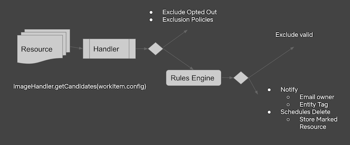
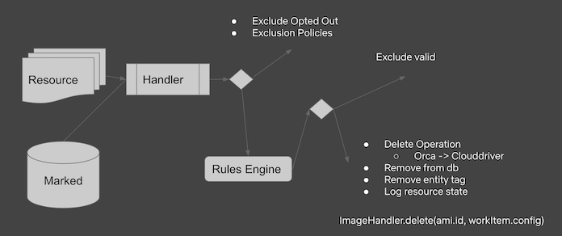

# Swabbie

_**IMPORTANT:** This service is currently under development, and is actively being used at Netflix for deleting images, 
ebs snapshots and auto scaling groups._

Swabbie automates the cleanup of unused resources such as EBS Volumes and Images.
As a Janitor Monkey replacement, it can also be extended to clean up a variety of resource types.
Swabbie applies a set of rules to mark cleanup candidates. 
Once marked, a resource is scheduled for deletion, and an owner is notified.
Before being deleted the resource is checked again to make sure it still qualifies for deletion.
If so, it is deleted.

## Deep Dive

For a more detailed understanding of how Swabbie works, visit [the internals doc](INTERNALS.md).

## How it works


During initialization swabbie schedules work to routinely mark, notify and delete resources.
The application configuration is flattened into work items that are placed on the work queue for processing:

*YAML config -> Work Items -> Work Queue*


Each visited resource is evaluated against the rules engine in order to determine if it should be marked for deletion.
If it is found to violate **rules**, the resource is tracked and an owner is notified.

Rules in the rules engine are configurable and can be composed similar to an `if/else` branching.
They can be defined with an `AND` (`&&`), or `OR` (`||`) operator:
 
- `AND`: A branch applies if all contained rules apply to the resource being evaluated.
- `OR`: A branch applies if any rule contained inside the branch applies.

```
enabledRules:
- operator: AND #branch1
  description: Empty Server Groups that have been disabled for more than than 45 days.
  rules:
    - name: ZeroInstanceRule
    - name: DisabledLoadBalancerRule
      parameters:
        moreThanDays: 45
- operator: OR #branch2
  description: Expired Server Groups.
  rules:
    - name: ExpiredResourceRule
```

Evaluates to `if ((branch1 || branch2) == true)` or `if (((ZeroInstanceDisabledServerGroupRule && AgeRule) || ExpiredResourceRule) == true)`

**Resource Marking Flow**:



**Resource Deletion Flow**:


## What's supported today
- Cloud Provider: `aws`
  * Netflix uses Edda
  * Vanilla AWS is also supported
- Resource Types:
  * AMIs
  * Server Groups
  * EBS Snapshots
  * ELBs
- Halyard: Not supported yet (PRs are welcome!)
  
## Contributing
If you're interested in contributing support for other providers or resource types, open an issue or join 
the Spinnaker Team slack and post in #swabbie.

Areas:
- Testing
- Documentation
- Other cloud provider
- Extensibility
 
## Running swabbie
Requirements: 
- Redis for storage
- Application YAML [Configuration](docs/swabbie.yml) (maps to [SwabbieProperties](swabbie-core/src/main/kotlin/com/netflix/spinnaker/config/SwabbieProperties.kt))

./gradlew run


